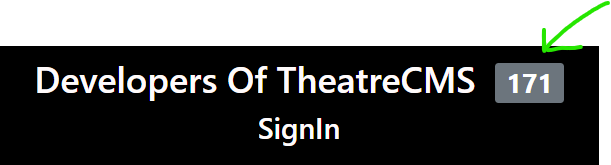
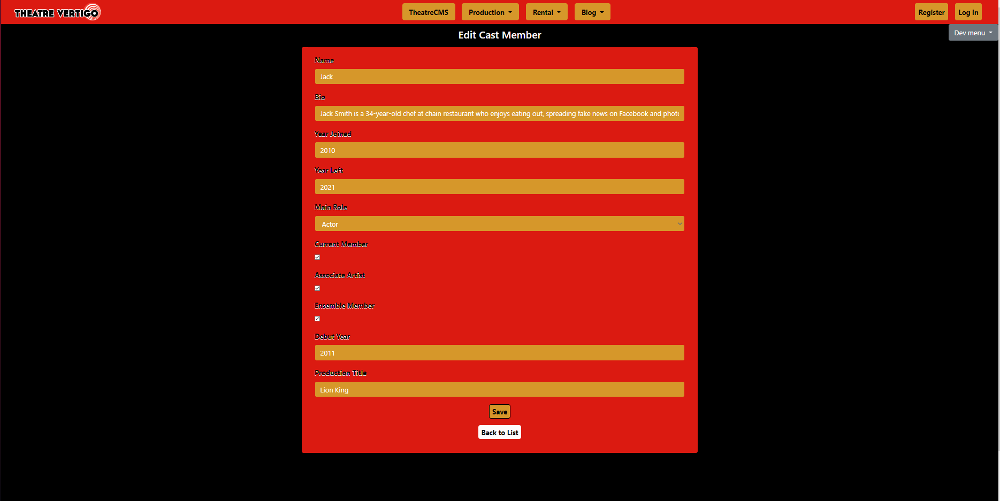

# Live Project

## Introduction

  For the last two weeks of my time at The Tech Academy, I worked with my peers on a team based project building a content management system for a Theater using C# with the .NET Framework. Building this full scale MVC application was a great learning opportunity for working with a legacy codebase, debugging, cleaning up code, and adding requested features. We utilized Git for our version contorl where we would clone the master to our local system, branch off and add code then commit our changes, push them and create pull request for the owner to lookover and accept. Occasionaly we'd have to deal with merge conflicts that taught us how to resolve said issues by comparing whats new to the master branch and is conflicitng with our working branch. We managed our entire project through Azure and utilized in house features within the IDE Visual Studio. I worked on several back end stories that taught me how to connect a database to communicate with a website in order to store data from users and admins. As well as adding CRUD functionality to affect the data. There were also many front end stories and UX improvements that came with the project. Needing to update or create new code and add css for a modernized website. Over the two week sprint we utilized agile and scrum methodologies where we'd have daily standups and a code retrospective each Friday. Teaching me the skills of time management, the software development life cycle, continuous integration and development. This project honed and gave me more confidence in my skills that I will implement on future projects.

Provided below are descriptions of the stories I worked on, along with code snippets and navigation links. 

## Back-End Stories
- [Create Entity Model and CRUD Pages](#Create-Entity-Model-and-CRUD-Pages)
- [Photo Storage and Retrieval](#Photo-Storage-and-Retrieval)

### Create Entity Model and CRUD Pages
In this story I had to create an entity model for the CastMember class so that individual cast members of the theater can be saved to the databse. 

1. First I created my CastMember class with the given properties. One of the properties was a special class of type enum. I used that for a dropdown that a cast member can select their role. After creating the class CastMember I used the NuGet Package manager > Package Manager Console to update-database which created the database-schema for the class.
```
namespace TheatreCMS3.Areas.Prod.Models
{
    public class CastMember
    {
        public int CastMemberId { get; set; }
        public string Name { get; set; }
        public string Bio { get; set; }
        public byte[] Photo { get; set; }
        public int? YearJoined { get; set; }
        public int? YearLeft { get; set; }
        public PositionEnum MainRole { get; set; }
        public bool CurrentMember { get; set; }
        public bool AssociateArtist { get; set; }
        public bool EnsembleMember { get; set; }
        public int? DebutYear { get; set; }
        public string ProductionTitle { get; set; }
    }

    public enum PositionEnum
    {
        Actor,
        Director,
        StageManager,
        Technician,
        Other
    }
}
```
2. next I began scaffolding my CRUD pages/controller. Which builds the controller first then all the CRUD pages with their respective functionality. I chose the Model Class that I created, a context class that would define the main entry point for the LINQ to SQL framework. Automatically generated views and a base layout page that would have a uniform navigation panel and styling for all the pages.  


### Photo Storage and Retrieval
The goal of this story was to allow users to upload files from their file system that would then display an image of themself with their details. This image would be converted into a byte array (byte[]) and stored in the database as such. The byte[] representing the photo would be retrieved from the databse and converted back into an image where it can be displayed on a View. This is demonstrated in the code block below. The if statement is nested in my
```
public ActionResult Create([Bind(Include = "CastMemberId,Name,Bio,YearJoined,YearLeft,MainRole,CurrentMember,AssociateArtist,EnsembleMember,DebutYear,Photo,ProductionTitle")] CastMember castMember, HttpPostedFileBase photo1)

``` method. 
```
if (ModelState.IsValid)
{
    if (photo1 == null)
    {
        castMember.Photo = null;
    }
    else { 
    castMember.Photo = new byte[photo1.ContentLength];
    photo1.InputStream.Read(castMember.Photo, 0, photo1.ContentLength);
    }
    db.CastMembers.Add(castMember);
    db.SaveChanges();
    return RedirectToAction("Index");
```

- Here I create a method in my controller that has a parameter for an uploaded photo and converts that photo into a byte[]. I also had to add a new file input field to the Create and Edit Views that would utilize that method I created in the controller converting images to byte[]'s. This is the storage portion of the story.

*Jump to: [Front-End Stories](#Fronte-End-Stories), [Back-End Stories](#Back-End-Stories), [Skills Learned](#Skills-Learned), [Top Page](#Introduction)*


## Front-End Stories
- [Sign-In-Page](#Sign-in-page)
- [Style Create & Edit Pages](#Style-Create-&-Edit-Pages)
- [Style Index Page](#Style-Index-Page)
- [Style Details & Delete Pages](#Style-Details-&-Delete-Pages)

### Sign-in-page
In this story I had to create a function using JavaScript and/or jQuery to count the number of names on the sign-in page and display them next to the title. I used a bootstrap badge to style the number displayed. 

- #### HTML
```
<div class="py-5 text-center">
  @*Centered text and padded bottom*@
  <h1>Developers Of TheatreCMS &nbsp;<span id="NumPersons" class="badge badge-secondary">Total</span></h1>
  <h2>SignIn</h2>
</div>

@* Add your name to the bottom of the list like so: *@
@* <p>YOUR NAME</p> *@
<div class="home-signin--container" id="PersonList">
  <p>EXAMPLE NAME</p>
</div>
```
- #### JavaScript/jQuery
The block of code that is commented out was my initial attempt writing a function to display the number of developers signed in. It worked but I was challenged to find an alternative method. I then incorparated jQuery to target the elements I wanted to change opposed to using the `document.getElementById()` method.
```
//returns number of people Signed in
//function signInList() {
//    var divList = document.getElementById("PersonList");
//    var names = divList.getElementsByTagName("p").length;
//    document.getElementById("NumPersons").innerHTML = names; 
//}

//Jquery version returning number of people signed in
function signInList() {
    var divList = $("#PersonList p");
    $("#NumPersons").html(divList.length);
}
signInList();
```


### Style Create & Edit Pages
For this story I had to style the create and edit pages. I was assigned to add a header, style buttons, add placeholders to the input fields, center the container, and add other styling that would create uniformity with the other pages. I used razor syntax to use information from the 
- #### Cshtml
```
@model TheatreCMS3.Areas.Prod.Models.CastMember

@{
    ViewBag.Title = "Create";
    Layout = "~/Views/Shared/_Layout.cshtml";
}


@using (Html.BeginForm("Create", "CastMembers", FormMethod.Post, new { enctype = "multipart/form-data" } ))
{
    @Html.AntiForgeryToken()
    
    <div class="form-horizontal">
        <h4 class="Prod-All-header">Create Cast Member</h4>
        <div class="container col-md-10 justify-content-center Prod-All-container">
            <hr />
            @Html.ValidationSummary(true, "", new { @class = "text-danger" })

            <div class="form-group">
                @Html.LabelFor(model => model.Name, htmlAttributes: new { @class = "control-label col-md-2 Prod-All-label" })
                <div class="col-md-12 text-center">
                    @Html.EditorFor(model => model.Name, new { htmlAttributes = new { @class = "form-control Prod-All-form ", placeholder = "Enter your name" } })
                    @Html.ValidationMessageFor(model => model.Name, "", new { @class = "text-danger" })
                </div>
            </div>

            <div class="form-group">
                @Html.LabelFor(model => model.Bio, htmlAttributes: new { @class = "control-label col-md-2 Prod-All-label" })
                <div class="col-md-12">
                    @Html.EditorFor(model => model.Bio, new { htmlAttributes = new { @class = "form-control Prod-All-form ", @placeholder = "Enter your bio" } })
                    @Html.ValidationMessageFor(model => model.Bio, "", new { @class = "text-danger" })
                </div>
            </div>

            <div class="form-group">
                @Html.LabelFor(model => model.YearJoined, "Year Joined", htmlAttributes: new { @class = "control-label col-md-2 Prod-All-label" })
                <div class="col-md-12">
                    @Html.EditorFor(model => model.YearJoined, new { htmlAttributes = new { @class = "form-control Prod-All-form ", @placeholder = "Enter year joined" } })
                    @Html.ValidationMessageFor(model => model.YearJoined, "", new { @class = "text-danger" })
                </div>
            </div>

            <div class="form-group">
                @Html.LabelFor(model => model.YearLeft, "Year Left", htmlAttributes: new { @class = "control-label col-md-2 Prod-All-label" })
                <div class="col-md-12">
                    @Html.EditorFor(model => model.YearLeft, new { htmlAttributes = new { @class = "form-control Prod-All-form ", @placeholder = "Enter year left" } })
                    @Html.ValidationMessageFor(model => model.YearLeft, "", new { @class = "text-danger" })
                </div>
            </div>

            <div class="form-group">
                @Html.LabelFor(model => model.MainRole, "Main Role", htmlAttributes: new { @class = "control-label col-md-2 Prod-All-label" })
                <div class="col-md-12">
                    @Html.EnumDropDownListFor(model => model.MainRole, htmlAttributes: new { @class = "form-control Prod-All-form ", @placeholder = "What is your role" })
                    @Html.ValidationMessageFor(model => model.MainRole, "", new { @class = "text-danger" })
                </div>
            </div>

            <div class="form-group">
                @Html.LabelFor(model => model.CurrentMember, "Current Member", htmlAttributes: new { @class = "control-label col-md-2 Prod-All-label" })
                <div class="col-md-12">
                    <div class="checkbox">
                        @Html.EditorFor(model => model.CurrentMember)
                        @Html.ValidationMessageFor(model => model.CurrentMember, "", new { @class = "text-danger" })
                    </div>
                </div>
            </div>

            <div class="form-group">
                @Html.LabelFor(model => model.AssociateArtist, "Associate Artist", htmlAttributes: new { @class = "control-label col-md-2 Prod-All-label" })
                <div class="col-md-12">
                    <div class="checkbox">
                        @Html.EditorFor(model => model.AssociateArtist)
                        @Html.ValidationMessageFor(model => model.AssociateArtist, "", new { @class = "text-danger" })
                    </div>
                </div>
            </div>

            <div class="form-group">
                @Html.LabelFor(model => model.EnsembleMember, "Ensemble Member", htmlAttributes: new { @class = "control-label col-md-2 Prod-All-label" })
                <div class="col-md-12">
                    <div class="checkbox">
                        @Html.EditorFor(model => model.EnsembleMember)
                        @Html.ValidationMessageFor(model => model.EnsembleMember, "", new { @class = "text-danger" })
                    </div>
                </div>
            </div>

            <div class="form-group">
                @Html.LabelFor(model => model.DebutYear, "Debut Year", htmlAttributes: new { @class = "control-label col-md-2 Prod-All-label" })
                <div class="col-md-12">
                    @Html.EditorFor(model => model.DebutYear, new { htmlAttributes = new { @class = "form-control Prod-All-form ", @placeholder = "Enter Year debuted" } })
                    @Html.ValidationMessageFor(model => model.DebutYear, "", new { @class = "text-danger" })
                </div>
            </div>

            <div class="form-group">
                @Html.LabelFor(model => model.ProductionTitle, "Production Title", htmlAttributes: new { @class = "control-label col-md-2 Prod-All-label" })
                <div class="col-md-12 text-center">
                    @Html.EditorFor(model => model.ProductionTitle, new { htmlAttributes = new { @class = "form-control Prod-All-form ", placeholder = "Enter Production Participating" } })
                    @Html.ValidationMessageFor(model => model.ProductionTitle, "", new { @class = "text-danger" })
                </div>
            </div>

            <div class="form-group">
                @Html.LabelFor(model => model.Photo, htmlAttributes: new { @class = "control-label col-md-2 Prod-All-label" })
                <div class="col-md-12">
                    <input type="file" id="photo1" name="photo1" />
                </div>
            </div>

            <div class="col-md-offset-2 col-md-12 text-center">
                <input type="submit" value="Create" class="Prod-All-MainBtn btn-default" />
            </div>

            <div class="col-md-offset-2 col-md-12 text-center Production-Create-ButtonSpace">
                @Html.ActionLink("Back to List", "Index", null, new { @class = "btn Prod-All-SecondaryBtn" })
            </div>
        </div>
    </div>
}


@section Scripts {
    @Scripts.Render("~/bundles/jqueryval")
}
```

- #### css
With the css that was added, the team and I agreed upon a naming convention and some general styles to have uniformity throughout the entire prodcutions area of the Theater website. This would help us to use DRY coding principles.
```
.Prod-All-container /*.CastMembers-CreateEdit--Container*/ {
    border-radius: .25rem;
    background-color: var(--main-color);
    padding-bottom: 1rem;
}

.Prod-All-header /*.CastMembers-CreateEdit--header*/ {
    text-align: center;
    margin-top: 9px;
}

.Prod-All-label /*Form Labels (was CastMembers-CreateEdit--label)*/ {
    color: var(--dark-color);
    font-weight: 700;
    max-width: 100%;
    text-shadow: -.2px 1px 0px var(--light-color);
}

.Prod-All-form /* (Form Input boxes (was CastMembers-CreateEdit--form)*/ {
    background-color: var(--secondary-color);
    border-color: var(--main-color);
    color: white;
}

    .Prod-All-form:focus {
        color: var(--secondary-color);
        border-color: var(--dark-color);
        background-color: var(--light-color);
        box-shadow: 10px 5px 5px var(--secondary-color);
    }

    .Prod-All-form::placeholder {
        color: var(--light-color);
        opacity: 1; /* Firefox */
    }

    .Prod-All-form:focus::placeholder {
        color: var(--secondary-color);
        opacity: 1; /* Firefox */
    }

.Prod-All-MainBtn {
    font-size: 16px;
    border-radius: 5px;
    background-color: var(--secondary-color);
    padding: 3px 6px 3px 6px;
    font-weight: bold;
}

    .Prod-All-MainBtn:hover {
        background-color: var(--dark-color);
        color: var(--secondary-color--dark);
    }

.Prod-All-SecondaryBtn {
    font-size: 16px;
    border-radius: 5px;
    background-color: var(--light-color);
    padding: 3px 6px 3px 6px;
    font-weight: bold;
    text-decoration: none;
    color: var(--dark-color);
}

    .Prod-All-SecondaryBtn:hover {
        background-color: var(--dark-color);
        color: var(--secondary-color--dark);
    }

.Prod-All-PillBadgeColor {
    background-color: var(--secondary-color);
    color: var(--light-color);
}

    .Prod-All-PillBadgeColor:hover {
        background-color: var(--dark-color);
        color: var(--secondary-color--dark);
    }

.Prod-All-textsearchbox_spacing {
    margin-left: .5rem;
}

.Prod-All-topsearchbox_width {
    width: 25%;
}

.Prod-All-PagingLinkPos {
    float: right;
}

.Prod-All-PagingPageContainer {
    padding-top: 2.5rem;
    text-align: center;
}

.Prod-All-PagingPageNum {
    font-weight: bold;
}

.Prod-All-PagingLinkButton {
    text-decoration: none;
    color: var(--dark-color)
}

    .Prod-All-PagingLinkButton:hover {
        background-color: var(--dark-color);
        color: var(--secondary-color--dark);
        text-decoration: none;
    }

.Prod-All-modalheader {
    background-color: var(--dark-color);
    color: var(--dark-color);
}

.Prod-All-modaltitle {
    text-align: center;
    margin-top: -10px;
    padding-bottom: 1rem;
    text-decoration: underline solid var(--secondary-color--dark) 3px;
    /* color: var(--dark-color); */
    text-transform: uppercase;
    text-shadow: 2px 2px 4px var(--secondary-color);
    font-weight: 800;
    background-color: var(--dark-color);
    color: var(--light-color);
}

.Prod-All-modaldt {
    color: var(--dark-color);
    font-size: 1.5rem;
    font-weight: 700;
    width: max-content;
    padding: 6px 0px 6px 0px;
    margin-left: auto;
    margin-right: auto;
    text-shadow: 2px 2px 3px white;
}

.Prod-All-modaldd {
    background-color: var(--secondary-color);
    border-color: var(--main-color);
    color: var(--light-color);
    width: fit-content;
    margin-left: auto;
    margin-right: auto;
    padding: 2px 5px;
}

.Prod-All-modalclosebutton {
    background-color: transparent;
    border: 0;
    color: var(--light-color);
    float: right;
}

    .Prod-All-modalclosebutton:hover {
        background-color: transparent;
        border: 0;
        color: var(--main-color);
        float: right;
    }
```



### Style Index Page

### Style Details & Delete Pages


*Jump to: [Front-End Stories](#Fronte-End-Stories), [Back-End Stories](#Back-End-Stories), [Skills Learned](#Skills-Learned), [Top Page](#Introduction)*


## Skills Learned
-
-
-

*Jump to: [Front-End Stories](#Fronte-End-Stories), [Back-End Stories](#Back-End-Stories), [Skills Learned](#Skills-Learned), [Top Page](#Introduction)*
